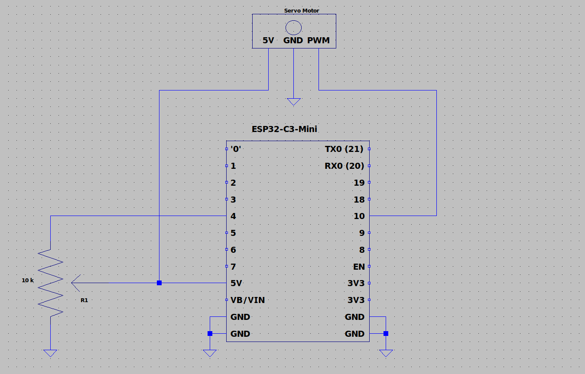
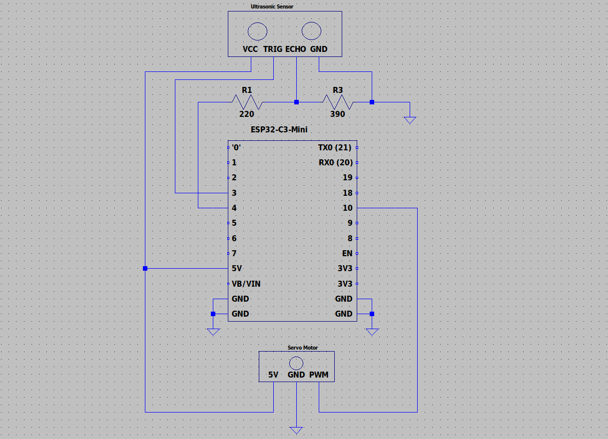

# Ultrasonic Trashcan

#### This project was derived from the IEEE Student Branch at UCI. This code consists of 2 modes/schematics. Both are related topic with different schematics but I combined them into one code with an option for each mode with user input. I have also created my own schematics within LTspice based off of the project's original schematic, so feel free to follow them for an exact setup or change them according to your need. The LTspice files are provided in the project.

---

### Potentiometer Controlled Servo:
First mode is a potentiometer controlled servo and the second, a ultrasonic sensor controlled servo. The first mode will simply go between 0-180 degrees by turning the potentiometer knob, making it good for debugging the motors and setting up correct install on the gear teeth. The second mode utilizes an ultrasonic sensor to rotate between two angles 

#### Circuit One Schematic:



---

### Ultrasonic Trashcan
The second mode utilizes an ultrasonic sensor to rotate the servo motor to a set angle when an object is detected within 20 cm of it. When the object is moved away, it will default to another set angle. This is used in a physical trashcan setup, where I attached the servo to a box to open when a hand is detected, and closes when the hand moves far.

#### Circuit Two Schematic:



---

## How to run
I ran this code on a WeAct Studio esp32c3 board.

If using the Arduino IDE, make sure the WeAct Studio esp32c3 board is the correct selected one and enable CDC on boot.

If running the script in CLI, it will prompt you for your board's serial port that it is connected to, so you need to find it and mention it. The serial port is usually /dev/ttyACM0 or /dev/ttyUSB0 but it could also be different. Also, if the shell script is not executable, chmod it.

If you prefer a manual/edited compilation and upload, either edit my shell script or simply copy them one at a time with custom flags, note that CDC on boot is required for the serial monitor to work.

Below is the easy script method in CLI.

### 1. Find Connected Serial Port
#### On Linux
```bash
ls /dev/tty*
```   

#### With Arduino CLI (recommended method)
```bash
arduino-cli board list
```

### 2. Run the program in CLI
```bash
./run.sh
```